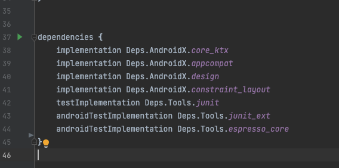
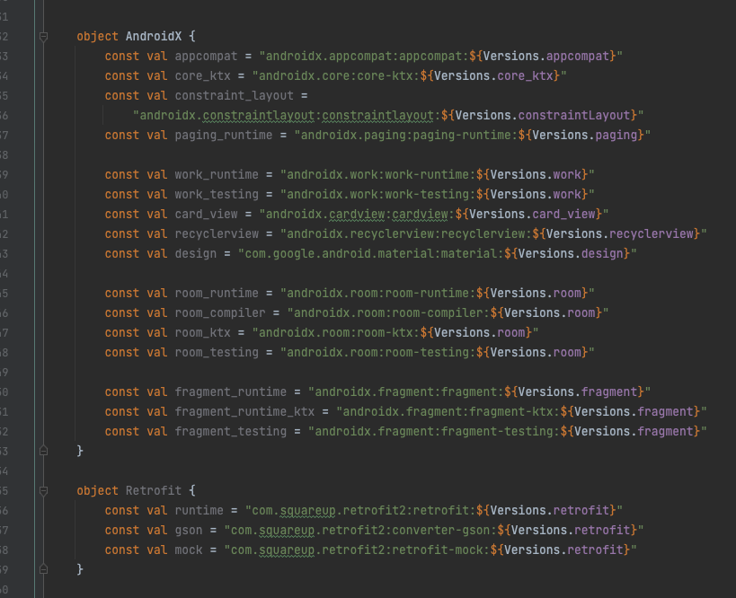

# Quality Demo


## composing build 管理依赖版本

>  请参照[掘进文章](https://juejin.cn/post/6844904176250519565)了解详情

> 如果使用 AGP 7.0以上版本，必须使用 IDEA 或者 Android Studio 2022.3.1


- 代码提示，不用每次都copy 出现代码不一致的情况



- 版本统一管理，不会出现多个版本情况



## 质量管理

 

```groovy
// Top-level build file where you can add configuration options common to all sub-projects/modules.
plugins {
    id 'com.android.application' version '7.0.3' apply false
    id 'com.android.library' version '7.0.3' apply false
    id 'org.jetbrains.kotlin.android' version '1.5.21' apply false
    id 'org.jetbrains.kotlin.jvm' version '1.5.21' apply false
    id 'legox.deps'
    id 'com.vanniktech.code.quality.tools' version '0.21.0'
}

codeQualityTools {
    htmlReports = true
    textReports = true

    checkstyle {
        toolVersion '10.0'
        configFile = file("config/checkstyle/checkstyle.xml")
    }

    detekt {
        toolVersion = '1.19.0'
        config = file("config/detekt/detekt.yml")
    }

    pmd {
        toolVersion = '6.43.0'
        ruleSetFile = file("config/pmd/pmd.xml")
    }

    cpd {
        minimumTokenCount = 20
    }
}

```


```shell
./gradlew check  # 此脚本全面会调用 checkstyle、detekt、klint、lint、pmd、cpd 来检查代码，全部通过才可以合并
```
